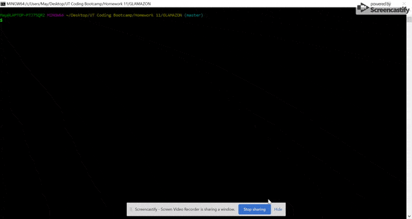
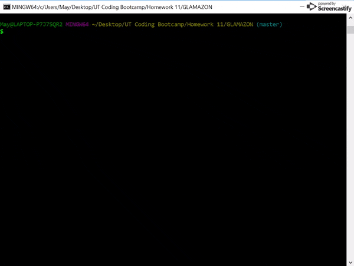

# GLAMAZON

### Submission on BCS

* Please submit the link to the Github Repository!
* Add to Portfolio.

## Overview

This project creates an Amazon-like storefront using MySQL and Node.js. The app will take in orders from customers and deplete stock from the store's inventory. As a bonus, the app can track product sales across the store's departments and then provide a summary of the highest-grossing departments in the store.

## Installation

1. Clone this repository to your computer and install dependencies:

with SSH:
```
git clone git@github.com:mkd454/GLAMAZON.git
```

go to the root of your glamazon folder
```
npm install
```

2. Set up your MySQL credentials. Open `glamazon.sql` in your sql editor and run the script.

3. Run the app with one of the following commands. Usage for each is documented below:
``` 
node glamazonCustomer.js
node glamazonManager.js
node glamazonSupervisor.js
```

## Application Features
### Customer View

1. Uses MySQL Database called `glamazon`.
2. Running the glamazonCustomer.js file application will first display all of the items available for sale. 
3. The app will prompt the user with two messages.
   * The first will ask the user the ID of the product they would like to buy.
   * The second message will ask how many units of the product they would like to buy.
4. Once the customer has placed the order, the application will check if it has enough of the product to meet the customer's request.
   * If not, the app will tell the customer there is not enough in stock and then prevent the order from going through.
5. However, if the store _does_ have enough of the product, the customer's order will be fulfilled.
   * The SQL database will be updated to reflect the remaining quantity.
   * Once the update goes through, the customer will be shown the total cost of their purchase.

#### Customer Example Demo
<br>

### Manager View

1. Uses MySQL Database called `glamazon`.
2. Running `bamazonManager.js` will:

  * List a set of menu options:

    * View Products for Sale
    
    * View Low Inventory
    
    * Add to Inventory
    
    * Add New Product

    * Exit and End Session

3. If a manager selects `View Products for Sale`, the app will list every available item: the item IDs, names, prices, and quantities.
4. If a manager selects `View Low Inventory`, then it will list all items with an inventory count lower than five.
5. If a manager selects `Add to Inventory`, your app will display a prompt that will let the manager "add more" of any item currently in the store.
6. If a manager selects `Add New Product`, it will allow the manager to add a completely new product to the store.
7. If a manager selects `Exit and End Session`, it will quit the application.

#### Manager Example Demo
<br>

### Supervisor View

1. Running `bamazonSupervisor.js` will list a set of menu options:

   * View Product Sales by Department
   
   * Create New Department

2. When a supervisor selects `View Product Sales by Department`, the app will display a summarized table in their terminal/bash window. Use the table below as a guide.

| department_id | department_name | over_head_costs | product_sales | total_profit |
| ------------- | --------------- | --------------- | ------------- | ------------ |
| 01            | Electronics     | 10000           | 20000         | 10000        |
| 02            | Clothing        | 60000           | 100000        | 40000        |

3. The `total_profit` column should be calculated on the fly using the difference between `over_head_costs` and `product_sales`. `total_profit` should not be stored in any database. You should use a custom alias.

4. If you can't get the table to display properly after a few hours, then feel free to go back and just add `total_profit` to the `departments` table.

   * Hint: You may need to look into aliases in MySQL.

   * Hint: You may need to look into GROUP BYs.

   * Hint: You may need to look into JOINS.

   * **HINT**: There may be an NPM package that can log the table to the console. What's is it? Good question :)

## Technologies Used
* [Node.js](https://www.npmjs.com/)
  - [Inquirer](https://github.com/SBoudrias/Inquirer.js)
  - [MySQL](https://github.com/mysqljs/mysql)
  - [CLI-Table](https://github.com/Automattic/cli-table)
* [MySQL Workbench](https://dev.mysql.com/downloads/workbench/)

## Where users can get help with this project
If you need assistance, please reach out to this email with your questions and concerns: <dangmaryk@gmail.com>.

## Who maintains and contributes to this project 
Mary Dang
Github Repository link: <https://github.com/mkd454/liri-node-app>
Portfolio link: <https://mkd454.github.io/Portfolio-V2/>

## Acknowledgments

* Thanks to The Coding Boot Camp at UT Austin

- - -